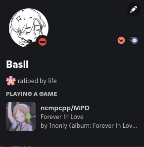

<h1 align="center">
    <a href="https://github.com/UwUham/mpd-rich-presence-discord">MPD Rich Presence for Discord</a>
</h1>

    <b>Broadcast MPD state via Discord Rich Presence</b>

  
  <dl>
    <dt><a href="#images">Images</a></dt>
    <dd><a href="#single-app-mode">Single App Mode</a></dd>
    <dt><a href="#command-line-arguments">Command Line Arguments</a></dt>
    <dt><a href="#compiling">Compiling</a></dt>
    <dt><a href="#similar">Similar</a></dt>

---

## Images

### Single App Mode
| State | Image |
| :-: | :-: |
| Playing | 
| Paused | 

---

## Command Line Arguments

Example: `mpd_discord_richpresence -h=211.111.111.112 -P=password -p=6606 --fork --no-idle --use-multiple-apps`

| Paramater| Purpose  |
|--|--|
|`-h=ADDDRESS`|The listen-address for MPD. (Defaults to `127.0.0.1`)|
|`-p=PORT`|The port which MPD is listening on. (Defaults to `6600`)|
|`-P=PASSWORD`|The password sent to MPD after the connection has been established successfully. (Default is empty, therefore no password sent.)|
|`--fork`|Forks the process into the background.|
|`--no-idle`|Disables broadcasting of the idle state.|
|`--no-pause`|Disables broadcasting of the paused state.|

> ⚠️ discord-rpc [will not work](https://github.com/discordapp/discord-rpc/issues/213#issuecomment-410631101) if Discord has been installed through snap (Ubuntu Software). Please download and install Discord from the [homepage](https://discordapp.com/).

---

## Compiling

### Dependencies
* pthread
* [discord-rpc](https://github.com/discordapp/discord-rpc)
* libmpdclient

A [build script](build.sh) is included.

The CMakeFile will take care of finding discord-rpc. If it cannot find it, it will pull the discord-rpc GitHub repo and compile from source.

---

## Similar

* [mpv-discordRPC, noaione](https://github.com/noaione/mpv-discordRPC) - MPV
* [foo_discord, NaamloosDT/](https://github.com/NaamloosDT/foo_discord) - foobar2000 rich presence
